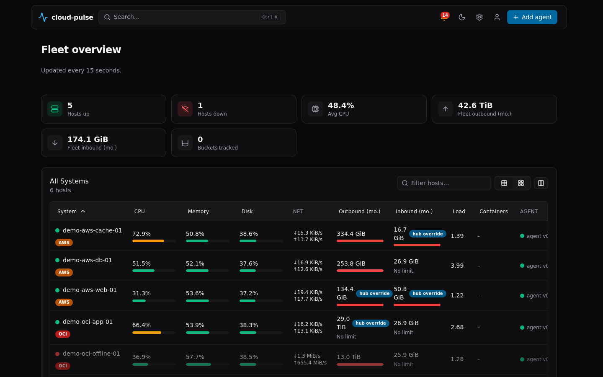

# cloud-pulse

Ultra-lightweight, CGO-free server monitor for small fleets — a
Beszel-inspired hub + agent, one static binary each, no runtime
dependencies, an embedded SQLite database, and a dashboard baked into the
binary.

[](https://github.com/leejeonghun001/cloud-pulse/actions/workflows/ci.yml)
[](https://github.com/leejeonghun001/cloud-pulse/releases)
[](LICENSE)
[](go.mod)



More screenshots: [host detail](docs/screenshots/host-detail.png) ·
[mobile](docs/screenshots/mobile.png)

## Features

- **15-second host metrics**: CPU, memory (true "available", not naive
  free), disk usage + IO, network rates, load average — pushed by a
  single-binary agent over HTTP(S).
- **Monthly egress accounting** with provider-aware defaults (AWS 100 GB,
  OCI 10 TB) and alerts at 80/95/100% of the limit via a Slack- or
  Discord-compatible webhook.
- **Cloud object storage monitoring**: Amazon S3 via CloudWatch, Cloudflare
  R2 via GraphQL Analytics, collected every 15 minutes by default.
- **Single static binaries**, `CGO_ENABLED=0` always, no AWS SDK (hand-written
  SigV4), embedded SQLite (`modernc.org/sqlite`) with 15s/5m/1h rollups and
  automatic retention pruning.
- **Embedded dashboard** — vanilla ES modules + vendored uPlot charts +
  prebuilt Tailwind CSS, no Node.js needed to run the hub, no CDN calls at
  runtime.

## Architecture

```
                    Tailscale HTTPS/HTTP + bearer PSK
 ┌──────────┐   push    ┌──────────────────────────────┐   pulls    ┌─────────────┐
 │  agent A │──────────▶│                              │───────────▶│  CloudWatch │
 ├──────────┤   push    │             hub              │            │   (S3)      │
 │  agent B │──────────▶│  REST API · SQLite · collec-  │            └─────────────┘
 ├──────────┤   push    │  tors · embedded dashboard    │───────────▶┌─────────────┐
 │  agent N │──────────▶│                              │            │  Cloudflare │
 └──────────┘           └──────────────────────────────┘            │  GraphQL(R2)│
                                       │ serves                     └─────────────┘
                                       ▼
                                  ┌─────────┐
                                  │ browser │
                                  └─────────┘
```

Agents push metrics to the hub over HTTP(S) authenticated with a
pre-shared bearer token (`CP_AGENT_TOKEN`) — no inbound access to agents
is required, so it works behind NAT/CGNAT. The hub separately polls AWS
CloudWatch and Cloudflare's GraphQL Analytics API on a timer for object
storage stats, and serves both a JSON REST API and its own embedded
dashboard to the browser.

## Quick start

Install the hub (as root or via `sudo`):

```bash
curl -fsSL https://raw.githubusercontent.com/leejeonghun001/cloud-pulse/main/scripts/install-hub.sh \
  | sudo bash
```

This downloads the correct `cloud-pulse-hub` release binary for your
OS/arch, verifies its sha256 against the release's `checksums.txt`,
installs it under `/usr/local/bin`, creates an unprivileged `cloud-pulse`
system user, generates `CP_AGENT_TOKEN`, writes `/etc/cloud-pulse/hub.env`
(mode `0640`), and installs+starts a hardened systemd unit. At the end it
prints a ready-to-copy agent install one-liner with the hub's Tailscale/LAN
IP and the generated token filled in:

```bash
curl -fsSL https://raw.githubusercontent.com/leejeonghun001/cloud-pulse/main/scripts/install-agent.sh \
  | sudo bash -s -- --hub-url http://<hub-ip>:8090 --token <printed-token>
```

- **Upgrade**: re-run the same installer command; the binary and systemd
  unit are replaced, `hub.env`/`agent.env` secrets are preserved unless you
  pass an explicit flag to change them.
- **Uninstall**: add `--uninstall` (stops/disables the service, removes the
  binary and unit; config and data are kept). Add `--purge` as well to also
  remove `/etc/cloud-pulse/*.env` and (hub only) the data directory.
- **Dry run**: add `--dry-run` to any invocation to print the actions that
  would be taken without changing anything.
- Run either script with `--help` for the full flag list.

## Tailscale setup

cloud-pulse is designed to run on a [Tailscale](https://tailscale.com)
tailnet: agents and the browser reach the hub over Tailscale's private
mesh, so the hub's HTTP API never needs to be exposed on the public
internet.

1. Install Tailscale on the hub host and every agent host, and log them
   into the same tailnet.
2. On the hub, find its Tailscale IP: `tailscale ip -4`.
3. Point agents at that IP with `--hub-url http://<tailscale-ip>:8090`.
4. The hub binds to all interfaces (`CP_LISTEN=":8090"` by default) but
   enforces an **IP allowlist** on every request's `RemoteAddr`
   (`X-Forwarded-For` and other client-supplied headers are never
   trusted). The default allowlist (`CP_ALLOWED_CIDRS`) is:
   - `100.64.0.0/10` — Tailscale's CGNAT range
   - `fd7a:115c:a1e0::/48` — Tailscale's IPv6 ULA range
   - `127.0.0.0/8`, `::1/128` — loopback
5. Optionally run `tailscale serve https / http://127.0.0.1:8090` on the
   hub to get a browser-trusted HTTPS URL for the dashboard without
   opening any port beyond the tailnet.
6. If you widen `CP_ALLOWED_CIDRS` (e.g. to `*` for a non-Tailscale
   deployment), also set `CP_UI_TOKEN` so the read API and dashboard
   require a bearer token — otherwise the hub warns loudly at startup
   that it is unauthenticated and reachable from anywhere it's exposed.

## AWS S3 setup

The hub polls Amazon CloudWatch directly (no AWS SDK; a hand-written SigV4
signer) — it never touches your bucket's object data, only metrics.

**IAM policy** (attach to the IAM user/role whose keys you configure):

```json
{
  "Version": "2012-10-17",
  "Statement": [
    {
      "Effect": "Allow",
      "Action": "cloudwatch:GetMetricData",
      "Resource": "*"
    }
  ]
}
```

**Environment variables**:

| Variable | Purpose |
|---|---|
| `CP_S3_BUCKETS` | `name[:region],...` — buckets to collect, e.g. `my-bucket:us-east-1,other-bucket` |
| `CP_S3_REGION` / `AWS_REGION` | Default region for entries in `CP_S3_BUCKETS` that omit `:region` (default `us-east-1`) |
| `AWS_ACCESS_KEY_ID` | AWS access key ID |
| `AWS_SECRET_ACCESS_KEY` | AWS secret access key |
| `AWS_SESSION_TOKEN` | Optional, for temporary/STS credentials |
| `CP_S3_FILTER_ID` | S3 request-metrics filter ID (default `EntireBucket`) |

**Storage metrics** (`BucketSizeBytes`, `NumberOfObjects`) are CloudWatch's
free, always-on daily storage metrics — no bucket configuration needed.

**Request metrics** (`AllRequests`, per-class GET/PUT/HEAD/LIST/etc. counts,
`BytesDownloaded`) require **S3 Request Metrics** to be explicitly enabled
on the bucket, which is a **paid** CloudWatch feature billed by AWS. Without
it, cloud-pulse reports `request_metrics_available: false` for that bucket
(not an error — storage size/object count still work). Enable it with a
filter ID matching `CP_S3_FILTER_ID` (default `EntireBucket`):

```bash
aws s3api put-bucket-metrics-configuration \
  --bucket my-bucket \
  --id EntireBucket \
  --metrics-configuration Id=EntireBucket
```

Or via the console: bucket → **Metrics** tab → **Create filter**, filter
name `EntireBucket`, no prefix/tag filter (covers the whole bucket).

## Cloudflare R2 setup

The hub queries Cloudflare's GraphQL Analytics API — no S3-compatible API
calls, no object listing.

1. Create an API token at **Cloudflare dashboard → My Profile → API
   Tokens** with the **Account Analytics: Read** permission for the
   account that owns the R2 buckets.
2. Set:

   | Variable | Purpose |
   |---|---|
   | `CP_R2_ACCOUNT_ID` | Cloudflare account ID |
   | `CP_R2_API_TOKEN` | API token with Account Analytics: Read |
   | `CP_R2_BUCKETS` | Optional comma-separated bucket names; empty = all buckets visible in the account's analytics |

R2's free tier (used to render usage bars in the dashboard) is **10 GB**
storage, **1,000,000** Class A operations, and **10,000,000** Class B
operations per month. R2 egress is always free, so cloud-pulse does not
track R2 egress bytes.

## Configuration reference

### Hub environment variables (`CP_*`)

| Variable | Default | Notes |
|---|---|---|
| `CP_LISTEN` | `:8090` | HTTP listen address |
| `CP_DATA_DIR` | `./data` | Directory holding `cloud-pulse.db` |
| `CP_AGENT_TOKEN` | *(required)* | ≥16 chars; authenticates agent report ingestion |
| `CP_UI_TOKEN` | *(unset)* | ≥8 chars if set; authenticates read endpoints + dashboard |
| `CP_ALLOWED_CIDRS` | `100.64.0.0/10,fd7a:115c:a1e0::/48,127.0.0.0/8,::1/128` | Comma-separated CIDRs/IPs allowed to reach the hub; `*` disables the allowlist |
| `CP_OFFLINE_AFTER` | `60s` | Host reported "down" after this long since last-seen |
| `CP_CLOUD_INTERVAL` | `15m` (min `1m`) | Interval between S3/R2 collections |
| `CP_ALERT_WEBHOOK_URL` | *(unset)* | Slack- or Discord-compatible webhook for egress alerts |
| `CP_LOG_LEVEL` | `info` | `debug\|info\|warn\|error` |
| `CP_LOG_FORMAT` | `text` | `text\|json` |
| `CP_S3_BUCKETS` | *(unset)* | `name[:region],...` |
| `CP_S3_REGION` / `AWS_REGION` | `us-east-1` | Default region for bucket entries without `:region` |
| `AWS_ACCESS_KEY_ID` / `AWS_SECRET_ACCESS_KEY` / `AWS_SESSION_TOKEN` | *(unset)* | AWS credentials for CloudWatch calls |
| `CP_S3_FILTER_ID` | `EntireBucket` | S3 request-metrics filter ID |
| `CP_R2_ACCOUNT_ID` / `CP_R2_API_TOKEN` | *(unset)* | Cloudflare R2 credentials |
| `CP_R2_BUCKETS` | *(unset, = all)* | Comma-separated R2 bucket names |

S3 collection is enabled only when `CP_S3_BUCKETS` is non-empty **and**
both AWS key env vars are set. R2 collection is enabled only when both
`CP_R2_ACCOUNT_ID` and `CP_R2_API_TOKEN` are set.

### Hub CLI flags (`cloud-pulse-hub`)

| Flag | Purpose |
|---|---|
| `-listen ADDR` | Override `CP_LISTEN` |
| `-data-dir DIR` | Override `CP_DATA_DIR` |
| `-check-config` | Load + validate config, print a secret-redacted summary, exit |
| `-gen-token` | Print a random 32-byte hex token (for `CP_AGENT_TOKEN`/`CP_UI_TOKEN`) and exit |
| `-version` | Print version info and exit |

### Agent environment variables (`CP_*`)

| Variable | Default | Notes |
|---|---|---|
| `CP_HUB_URL` | *(required)* | Hub base URL, `http://` or `https://` |
| `CP_AGENT_TOKEN` | *(required)* | ≥16 chars; must match the hub's `CP_AGENT_TOKEN` |
| `CP_HOST_ID` | sanitized hostname | 1–128 chars of `[A-Za-z0-9._-]` if set explicitly |
| `CP_INTERVAL` | `15s` (min `5s`) | Collect/report interval |
| `CP_PROVIDER` | `auto` | `auto\|aws\|oci\|other`; `auto` detects via Linux DMI |
| `CP_EGRESS_LIMIT_GB` | *(unset = provider default)* | `0` = unlimited; GiB units, fractional allowed |
| `CP_NET_EXCLUDE` | `lo,lo0,docker*,veth*,br-*,virbr*,tailscale*,utun*,cni*,flannel*,cali*,kube*,vxlan*,tun*,wg*,zt*` | Comma-separated interface-name globs excluded from egress/network accounting |
| `CP_LOG_LEVEL` | `info` | `debug\|info\|warn\|error` |
| `CP_LOG_FORMAT` | `text` | `text\|json` |

### Agent CLI flags (`cloud-pulse-agent`)

| Flag | Purpose |
|---|---|
| `-once` | Collect two samples 1s apart, print the second as JSON, exit (no hub config needed) |
| `-print-host` | Print detected `HostInfo` as JSON and exit (requires hub config) |
| `-version` | Print version info and exit |

## Egress accounting

Egress is approximated as the **sum of TX byte deltas on physical network
interfaces**, accumulated per **UTC calendar month**. Virtual/tunnel
interfaces are excluded by default via `CP_NET_EXCLUDE` (loopback, Docker
bridges/veth, Tailscale, generic VPN tunnel prefixes — see the table
above for the exact glob list).

This is an **approximation**, not a billing-accurate figure:

- Intra-region and intra-VPC traffic is counted the same as internet
  egress, even though many providers don't bill for it.
- AWS's real 100 GB free tier is aggregated **across the whole account**,
  not per host — cloud-pulse tracks each host independently.
- OCI's 10 TB free tier is **per tenancy**, same caveat.
- The projected month-end figure is a simple linear projection from
  month-to-date usage, not a forecast that accounts for traffic patterns.

Set `CP_EGRESS_LIMIT_GB` per host to override the provider default (AWS
100 GB, OCI 10 TB, other = unlimited) when your actual billing terms
differ. Alerts fire once per host per month at each of 80% (warning), 95%
(critical), and 100% (exceeded) of the configured limit, via
`CP_ALERT_WEBHOOK_URL`.

## REST API

All responses are JSON. Read endpoints (`GET`, except `/healthz` and static
assets) require `Authorization: Bearer <CP_UI_TOKEN>` only when
`CP_UI_TOKEN` is set.

| Method & path | Purpose |
|---|---|
| `POST /api/v1/agent/report` | Ingest a batch of samples (`Authorization: Bearer <CP_AGENT_TOKEN>`) |
| `GET /api/v1/hosts` | List all hosts with status, latest sample, egress usage |
| `GET /api/v1/hosts/{id}` | One host's summary |
| `GET /api/v1/hosts/{id}/metrics?range=1h\|6h\|24h\|7d\|30d` | Time series for charts (default `1h`) |
| `GET /api/v1/egress?month=YYYY-MM` | Per-host egress usage for a month (default current) |
| `GET /api/v1/buckets` | Latest S3/R2 stats, 24h history, collector status |
| `GET /api/v1/version` | Build version/commit/date |
| `GET /healthz` | Liveness check, no auth |
| `GET /` and static assets | Embedded dashboard, no auth |

## Security model

- **Agent authentication**: bearer token compared in constant time
  (SHA-256 both operands, then `crypto/subtle.ConstantTimeCompare`) —
  never a plain `==`/`strings.Compare`.
- **Network access control**: an IP allowlist checked against
  `http.Request.RemoteAddr` only; `X-Forwarded-For` and other
  client-supplied headers are never trusted, so a reverse proxy in front
  of the hub is seen as its own IP, not the original client's.
- **Optional UI token**: `CP_UI_TOKEN` gates all read endpoints and the
  dashboard when set.
- **Security headers** on every response: CSP (`script-src 'self'`, no
  inline scripts, `frame-ancestors 'none'`), `X-Content-Type-Options:
  nosniff`, `Referrer-Policy: no-referrer`, `X-Frame-Options: DENY`.
- **Hardened systemd units**: `NoNewPrivileges`, `ProtectSystem=strict`,
  `ProtectHome=read-only`, `PrivateTmp`, `PrivateDevices`,
  `ProtectKernelTunables`, `ProtectControlGroups`, `RestrictSUIDSGID`,
  `LockPersonality`, empty capability set, `RestrictAddressFamilies=AF_INET
  AF_INET6 AF_UNIX` (neither binary needs `AF_NETLINK` — network metrics
  are read from `/proc`, not netlink sockets).
- **No secrets logged**: tokens and webhook URLs are logged only as
  `(set)`/`(not set)`, never their value, including in `-check-config`
  output.

## Development

```bash
make hooks   # git config core.hooksPath .githooks (run once after cloning)
make build   # build bin/cloud-pulse-hub + bin/cloud-pulse-agent
make test    # go test ./... (CGO_ENABLED=0)
make lint    # full pre-commit check suite on demand
make css     # rebuild web/assets/app.css from web/src/input.css via Tailwind CLI
```

Conventions (Go style, error handling, Clean Architecture layering, shell
script rules, commit format) are documented in
[CODING_CONVENTIONS.md](CODING_CONVENTIONS.md). Design/architecture
decisions and their rationale are in [DECISIONS_LOG.md](DECISIONS_LOG.md).

Other useful scripts:

- `bash scripts/smoke.sh` — end-to-end hub+agent smoke test (real
  binaries, real HTTP, real SQLite).
- `bash scripts/test-install.sh` — sandboxed install-script test suite
  (67 assertions: checksum verification, injection/RCE regression tests,
  upgrade/uninstall/purge, systemd unit validation).
- `python3 scripts/demo-seed.py --hub <url> --token <token> [--db <path>]` —
  seed a running hub with demo hosts and bucket stats for local UI
  development/screenshots.

## Releasing

Push a tag matching `vX.Y.Z` (or run the Release workflow manually with a
`tag` input). The release workflow builds all 8 target platforms
(`linux/{amd64,arm64,armv7}`, `darwin/{amd64,arm64}`,
`windows/{amd64,arm64}`, `freebsd/amd64`), generates `checksums.txt`, and
publishes them as flat release assets — no archives.

## Comparison / inspiration

cloud-pulse takes direct inspiration from [Beszel](https://github.com/henrygd/beszel),
a lightweight server monitoring hub/agent written in Go. The main
differences: cloud-pulse agents **push** metrics over HTTP(S) with a
pre-shared token instead of the hub pulling over SSH (simpler behind
NAT/CGNAT, especially on a Tailscale mesh), and cloud-pulse adds
first-class cloud egress accounting and S3/R2 object-storage monitoring
that Beszel doesn't target.

## License

[MIT](LICENSE)
